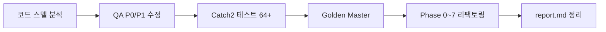

# Feedback Analyzer 실습 발표

**주제:** Before/After 코드 비교 & Cursor AI 활용 경험  
**시간:** 약 5분 (6슬라이드)  
**참고:** [report.md](./report.md) · [refactoring_result.md](./refactoring_result.md)

---

## 슬라이드 1 — 프로젝트 한 줄 (30초)

**Feedback Analyzer** = C++17 + cpp-httplib 웹앱  
고객 피드백 → 감성(긍/부/중립) + 카테고리(배송·품질 등) 분류·필터·CSV

| 항목 | 내용 |
|------|------|
| 실습 목표 | 의도적 레거시 스멜 제거 + **P0 버그 수정** |
| 원칙 | **테스트 Green에서만** 다음 리팩토링 진행 |
| 최종 | **74 tests Passed** + Golden Master + CI |

> **한마디:** “화면 통계와 필터 결과가 달랐던 이유를 코드 한 줄에서 찾고, AI와 테스트로 고쳤다.”

---

## 슬라이드 2 — 핵심 문제: P0 버그 (45초)

### 재현 시나리오 (발표 시 말로 설명)

1. 입력: `품질이 좋습니다` → 분석 화면 **품질: 1**
2. 필터: 감성=전체, 키워드=**품질**
3. **기대:** 1건 / **실제:** “필터링 결과 없음”

### 원인 (Cursor AI `qa_analysis.md` 진단)

| 구분 | 통계 (`kw`) | 필터 (`fil`) |
|------|-------------|--------------|
| 키워드 | `main`만 사용 | `main`을 **continue로 스킵** |
| 감성 | `Constants` | 별도 `S_KEYWORDS` (이중 사전) |

→ **같은 데이터인데 규칙이 두 벌** → 사용자 입장에서는 “버그”

---

## 슬라이드 3 — Before/After ① 카테고리 필터 (60초)

### Before — `main` 스킵

```cpp
for (const auto& subEntry : catMap) {
    if (subEntry.first == "main") continue;  // ← P0 원인
    if (containsAny(txt, subEntry.second)) {
        finalFiltered.push_back(item);
    }
}
```

### After — 통계와 동일 규칙

```cpp
if (CategoryMatcher::matchesMain(item.getText(), kFilter)) {
    filtered.push_back(item);
}
```

`CategoryRegistry::mainKeywords()` → **Single Source of Truth**

| 지표 | Before | After |
|------|--------|-------|
| `품질` 필터 | 0건 | 1건 |
| 테스트 | 실패/없음 | **FI-F05 Green** |

---

## 슬라이드 4 — Before/After ② 감성·구조 (60초)

### Before — 감성 이중 사전

- 통계: `Constants::SENTIMENT_KEYWORDS`
- 필터: `Filters::initFilterKeywords()` → `S_KEYWORDS`
- 예: `괜찮아요` → 통계 **중립**, 필터 **중립** 선택 시 **0건**

### After — `SentimentClassifier` 단일화

```cpp
[[nodiscard]] static Sentiment classify(std::string_view text) {
    if (containsAny(text, Constants::SENTIMENT_KEYWORDS[Constants::SENTIMENT_POSITIVE]))
        return Sentiment::Positive;
    if (containsAny(text, Constants::SENTIMENT_KEYWORDS[Constants::SENTIMENT_NEGATIVE]))
        return Sentiment::Negative;
    return Sentiment::Neutral;
}
```

### Before — God `main.cpp` (~350줄)

라우팅 + HTML + CSV + `fil_data` 전역 혼재

### After — 진입점 5줄

```cpp
int main() {
    FeedbackApp app;
    return app.run();
}
```

→ `FeedbackApp`, `*RouteHandler`, `HtmlPageRenderer`, `FeedbackRepository` 분리

---

## 슬라이드 5 — Cursor AI 활용 경험 (90초)

### 워크플로 (실습 순서)



### 프롬프트 패턴 (효과 있었던 것)

| 단계 | 역할 프롬프트 | 첨부 문서 | 산출물 |
|------|---------------|-----------|--------|
| 분석 | “코드 스멜·QA 전문가” | `README`, `qa_analysis` | `docs/qa_analysis.md` |
| 수정 | “시니어 C++ QA, 테스트 Green” | `test_plan` | P0/P1 패치 |
| 회귀 | “Golden Master 설계” | `golden_master.md` | `tests/expected/` |
| 리팩토링 | “Phase별, Green에서만” | `refactoring_plan.md` | `refactoring_result.md` |

**공통 규칙:** `@파일` 로 컨텍스트 고정 · **한 커밋 = 한 축** · `ctest`로 게이트

### AI가 잘 해준 일

- **스멜 ↔ 버그 매핑** (예: #2 중복 키워드 → P0 중립/품질 필터)
- **재현 시나리오·테스트 ID** 제안 (FI-F05, FI-F08)
- Phase 계획·검증 명령 (`ctest -R "[p0]"`, `GM-`)

### 주의했던 일 (사람이 검증)

| 항목 | 이유 |
|------|------|
| 동작 계약 고정 | 긍·부정 동시 → **긍정** (의도적 규칙, TA-S04) |
| Golden 갱신 | stdout·HTML 변경 시 `update_golden`만 의도적으로 |
| CSV 이스케이프 | `CSV-ESC` 계약 — 리팩토링에서 **미적용** 유지 |
| AI 일괄 리팩토링 금지 | Phase마다 Green 확인 후 다음 단계 |

---

## 슬라이드 6 — 결과 & 마무리 (45초)

### 숫자로 보는 결과

| 항목 | Before | After |
|------|--------|-------|
| 자동 테스트 | 0건 | **74 Green** |
| P0 (품질·중립·감성 일치) | 실패 | **Green** |
| `main.cpp` | God Module | **5줄 진입점** |
| 전역/데드코드 | `fil_data`, `S_KEYWORDS`, `FileHandler` | Repository·Classifier·삭제 |

### 검증 한 줄

```powershell
ctest --test-dir build --output-on-failure
```

### 한 줄 결론 (발표 클로징)

> **“AI는 분석·계획·보일러플레이트에 강하고, ‘통계=필터’ 같은 계약은 테스트가 진실을 지킨다.”**

### Q&A 대비

- **왜 `sent`/`fil` 이름을 남겼나?** → 레거시 alias, 호출부 점진 이전
- **다음 과제?** → Trend 시각화, File DB, 로그 UI level별 표시

---

## 발표 타임라인 (5분)

| 시간 | 슬라이드 | 내용 |
|------|----------|------|
| 0:00 | 1 | 프로젝트·목표 |
| 0:30 | 2 | P0 버그 데모 |
| 1:15 | 3 | 카테고리 Before/After |
| 2:15 | 4 | 감성·main Before/After |
| 3:15 | 5 | AI 워크플로·팁 |
| 4:30 | 6 | 결과·Q&A |

---

*2026-05-22 · Feedback Analyzer 리팩토링 실습*
