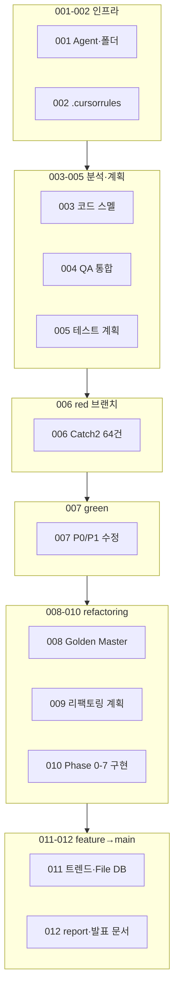

# Feedback Analyzer — 실습 진행 과정 통합 요약

**작성일:** 2026-05-22  
**원본:** `Report/001` ~ `Report/012` (작업 보고서 12건)  
**목적:** 번호 순서대로 각 세션을 요약하고, 전체 실습 흐름을 한 문서에서 파악할 수 있게 함

---

## 전체 흐름 (한눈에)

| 단계 | 보고서 | 브랜치 | 테스트 규모 | 핵심 성과 |
|------|--------|--------|-------------|-----------|
| 인프라 | 001~002 | main | — | Report/Prompting Agent, TDD 규칙 |
| 분석 | 003~005 | main/spec/red | — | qa_analysis, test_plan |
| Red | 006 | red | 64 (known-fail 8) | Catch2 전량, 버그 기준선 고정 |
| Green | 007 | green | 64 Green | P0/P1 레거시 수정 |
| 회귀 | 008 | refactoring | 76 Green | Golden Master 9건 |
| 계획 | 009 | refactoring | 76 Green | refactoring_plan |
| 리팩토링 | 010 | refactoring | 74 Green | Phase 0~7, main 분해 |
| 확장 | 011 | feature | 82 Green | 트렌드·감정 DB |
| 문서화 | 012 | feature→main | 82 | report.md, presentation.md |

---

## 001 — spec 브랜치 관리 및 Report/GitHub Agent 구축

| 항목 | 내용 |
|------|------|
| **일자·브랜치** | 2026-05-22 · main |
| **요약** | `spec` 브랜치 생성·push 후 삭제. UnitConverter 패턴을 참고해 **보고서 작성 및 저장 Agent**(`report-github-manager`)와 `Report/`, `Prompting/`, `Prompting_user/` 폴더, `next-report-id.ps1` 스크립트 구축. |
| **산출물** | `.cursor/agent/report-github-manager.md`, 첫 보고서 001 |
| **검증** | spec 브랜치 생성·삭제 성공, 스크립트 `001` 출력 |
| **다음** | `.gitignore`에 `build/` 추가, 보고서 002부터 누적 |

---

## 002 — Cursor AI 규칙(.cursorrules) 작성

| 항목 | 내용 |
|------|------|
| **일자·브랜치** | 2026-05-22 · main |
| **요약** | C++17·CMake·Catch2 TDD 규칙을 `.cursorrules`에 정리. Given-When-Then, `TEST_CASE_METHOD`, `should_*_when_*` 명명, Green 후 리팩토링, `git merge` 금지 등. |
| **산출물** | `.cursorrules` (~157줄) |
| **검증** | 문서 작업만 — 빌드/ctest 해당 없음 |
| **다음** | Catch2 CMake 연동, 첫 Red 테스트 |

---

## 003 — 코드 스멜 분석 (src/cpp)

| 항목 | 내용 |
|------|------|
| **일자·브랜치** | 2026-05-22 · main |
| **요약** | `src/cpp/` 정적 분석. 스멜 7건(축약명, 중복 키워드, Fake Session, 전역 상태, FileHandler 스텁, God main, 로직 중복)과 Phase 1~7·테스트 S/K/F/R/H 시나리오를 `docs/code_smell.md`에 저장. |
| **산출물** | `docs/code_smell.md` (521줄) |
| **검증** | 분석·문서만 |
| **다음** | F5 일관성 Red 테스트, SentimentClassifier 추출 |

---

## 004 — QA 분석·코드 스멜 문서 통합

| 항목 | 내용 |
|------|------|
| **일자·브랜치** | 2026-05-22 · spec |
| **요약** | QA 관점 P0~P2 결함 분석 후 `docs/qa_analysis.md` 작성. `code_smell.md`와 **통합**하고 `code_smell.md` 삭제. 스멜↔QA 매핑 표로 연결. |
| **산출물** | `docs/qa_analysis.md` (단일 참조 문서) |
| **P0 핵심** | `main` 스킵, 이중 감성 사전, 중립 필터 불일치 |
| **다음** | Catch2 Red, Phase 2 키워드 단일화 |

---

## 005 — 테스트 계획서 작성

| 항목 | 내용 |
|------|------|
| **일자·브랜치** | 2026-05-22 · red |
| **요약** | README·qa_analysis 기준 **Catch2 테스트 계획서**. P0/P1은 `[known-fail]`로 기준선 고정 전략. 레거시 `src/cpp/` 비수정. |
| **산출물** | `docs/test_plan.md` (431줄, 10절) |
| **검증** | 문서만 |
| **다음** | Sprint 1 — P0 TEST_F 15~20건 구현 |

---

## 006 — Catch2 테스트 전량 구현

| 항목 | 내용 |
|------|------|
| **일자·브랜치** | 2026-05-22 · red |
| **요약** | `tests/` 스캐폴딩 + 도메인·CSV·HTTP 통합. **64 test cases, 136 assertions** 전부 통과. 알려진 버그는 `[known-fail]` 8건으로 문서화. `main.cpp` 미링크, LegacyCsv/LegacyHtml 복제. |
| **산출물** | `tests/` 9 unit + 3 integration, README Test To Do [x], coverage 타깃 |
| **ID 범위** | FB, TA-S/K, FI-F, SE, CO, CSV, HTTP, EX, PERF, LG, UI, FH, HTML |
| **이슈** | `.github/workflows/tests.yml` — PAT `workflow` scope 없어 push 제외 |
| **다음** | known-fail 해제(리팩토링 후), lcov 90% |

---

## 007 — 레거시 P0/P1 결함 수정 및 테스트 Green

| 항목 | 내용 |
|------|------|
| **일자·브랜치** | 2026-05-22 · green |
| **요약** | qa_analysis·test_plan 기준 **프로덕션 코드 수정**. Filters `main` 정합·감성 사전 단일화, Constants 부정 `늦`/`늦다`, CSV `text`·업로드 통계, escapeHtml. **64/64 Green**, known-fail 해제. |
| **주요 수정** | `Filters`, `Constants`, `main.cpp`, 테스트·Legacy 헬퍼 동기화 |
| **검증** | 135 assertions, 64 cases All passed |
| **미해결** | fil_data, FileHandler, God main — 리팩토링 예정 |
| **다음** | qa_analysis 상태 갱신, Phase 3~7 |

---

## 008 — Golden Master(Approval) 회귀 테스트

| 항목 | 내용 |
|------|------|
| **일자·브랜치** | 2026-05-22 · refactoring |
| **요약** | 출력 기반 Golden Master — `tests/expected/`, `GoldenMaster.h`, GM-TA/FI/CSV/HTTP 9건. `update_golden` 타깃·스크립트. **76 tests Green**. |
| **산출물** | `docs/golden_master.md`, `tests/golden/`, `scripts/update_golden.*` |
| **검증** | `ctest -R "GM-"` 9/9, 전체 76/76 |
| **다음** | test_plan §2.4 교차 참조, HTML 전체 페이지 golden 확장 |

---

## 009 — 모던 C++ 리팩토링 계획 수립

| 항목 | 내용 |
|------|------|
| **일자·브랜치** | 2026-05-22 · refactoring |
| **요약** | **테스트 Green 전제** Phase 0~7 계획. 한 커밋=한 축, 동작 계약 6항, ctest 게이트. 소스 변경 없이 `docs/refactoring_plan.md`만 추가. |
| **Phase 요약** | 1 상수·UI / 2 Classifier·Matcher / 3 enum·rename / 4 Repository / 5 main 분해 / 6 FileHandler / 7 C++17 |
| **검증** | 76/76 Passed (계획만) |
| **다음** | Commit 1-1 Constants 중복 제거 |

---

## 010 — Phase 0~7 리팩토링 구현

| 항목 | 내용 |
|------|------|
| **일자·브랜치** | 2026-05-22 · refactoring |
| **요약** | refactoring_plan 전 Phase 적용. `FeedbackApp`, `SentimentClassifier`, `CategoryMatcher`, `FeedbackRepository`, `HtmlPageRenderer` 등. God `main.cpp` → 진입점 ~6줄. FileHandler YAGNI 삭제 → **74 tests**. |
| **산출물** | `docs/refactoring_result.md`, +140/-566 lines (24 files) |
| **검증** | 74/74 Passed, `[p0]`, `GM-*` Passed |
| **유지** | CSV 이스케이프 미적용, sent/kw/fil alias |
| **다음** | 커밋 히스토리 분할(선택), CI workflow 추적 |

---

## 011 — 추가 요구사항 (트렌드·감정 키워드 File DB)

| 항목 | 내용 |
|------|------|
| **일자·브랜치** | 2026-05-22 · feature |
| **요약** | project_purpose §6.1 항목 7. `date` CSV → **TrendAnalyzer** 차트, **SentimentKeywordDb** File DB·웹 관리 UI. `/trend/load-sample`, `/admin/sentiment`. **82/82 Green**. |
| **산출물** | `TrendAnalyzer.h`, `SentimentKeywordDb.h`, `docs/new_feature.md`, TR/DB/HTTP-TR01 테스트 |
| **검증** | ctest 82/82, GM H04 `;trend:no` 반영 |
| **다음** | PR, README 82 cases 갱신 |

---

## 012 — 코드리뷰·발표 문서 작성

| 항목 | 내용 |
|------|------|
| **일자·브랜치** | 2026-05-22 · feature → main merge |
| **요약** | Cursor AI 분석 종합 → `docs/report.md`. 5분 발표 → `docs/presentation.md`. 소스 변경 없음. |
| **산출물** | report.md (5절), presentation.md (6슬라이드) |
| **참고** | presentation 테스트 수 74 = 리팩토링 기준; 실제 main은 82 |
| **다음** | 발표 리허설, presentation 82건 동기화(선택) |

---

## 브랜치·테스트 진화

| 시점 | 브랜치 | 테스트 | 비고 |
|------|--------|--------|------|
| 006 | red | 64 pass | known-fail = 버그 기준선 |
| 007 | green | 64 Green | P0/P1 수정 |
| 008 | refactoring | 76 Green | +Golden 9 |
| 010 | refactoring | 74 Green | FH 2건 제거 |
| 011~012 | feature/main | 82 Green | +트렌드·DB 8 |

---

## 문서·코드 산출물 맵

| 보고서 | 핵심 docs | 핵심 코드/테스트 |
|--------|-----------|------------------|
| 001 | — | `.cursor/agent/*`, Report 구조 |
| 002 | — | `.cursorrules` |
| 003 | code_smell.md → 004에서 통합 | — |
| 004 | **qa_analysis.md** | — |
| 005 | **test_plan.md** | — |
| 006 | — | **tests/** 전체 |
| 007 | README 체크박스 | Filters, Constants, main |
| 008 | **golden_master.md** | tests/expected/, GM-* |
| 009 | **refactoring_plan.md** | — |
| 010 | **refactoring_result.md** | AppConfig, Classifier, FeedbackApp… |
| 011 | **new_feature.md** | TrendAnalyzer, SentimentKeywordDb |
| 012 | **report.md**, **presentation.md** | — |

---

## 반복 이슈·운영 메모

| 이슈 | 등장 보고서 | 상태 |
|------|-------------|------|
| `build/` 커밋 제외 | 001~012 | `.gitignore` 추가 권장(001) |
| `.github/workflows/tests.yml` push 실패 | 006, 008, 010, 011 | PAT `workflow` scope 필요 |
| 동작 계약(S4, main-only, CSV text) | 009, 010 | Green 유지 |
| 레거시 alias sent/kw/fil | 010, 012 | 점진 제거 예정 |

---

## Agent 워크플로 (공통)

`보고서 작성 및 저장 Agent` 실행 시 매 세션:

1. `Report/NNN-*.md` — 작업 보고서  
2. `Prompting/NNN-*-Prompt.md` — 전체 대화  
3. `Prompting_user/NNN-*-User.md` — User 프롬프트만  
4. `git commit` + `git push` (build/ 제외)

---

## 관련 문서

- [qa_analysis.md](./qa_analysis.md) — 분석 기준
- [test_plan.md](./test_plan.md) — 테스트 ID
- [refactoring_plan.md](./refactoring_plan.md) · [refactoring_result.md](./refactoring_result.md)
- [report.md](./report.md) — 코드리뷰 종합
- [presentation.md](./presentation.md) — 5분 발표
- [new_feature.md](./new_feature.md) — 트렌드·DB 기능

---

*Report/001~012 통합 요약 · 2026-05-22*
