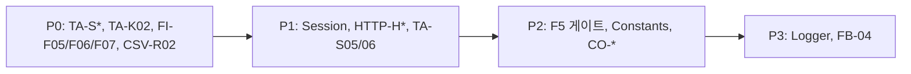

# Feedback Analyzer — 테스트 계획서

| 항목 | 내용 |
|------|------|
| **문서 버전** | 1.0 |
| **작성일** | 2026-05-22 |
| **기준 문서** | [README.md](../README.md), [qa_analysis.md](./qa_analysis.md), [project_purpose.md](../project_purpose.md) |
| **기술 스택** | C++17, Catch2 v3, CMake 3.14+ |
| **원칙** | **레거시 `src/cpp/` 코드는 수정하지 않음.** 실패하는 테스트는 알려진 결함(P0/P1)을 문서화하는 회귀 기준선으로 유지 |

---

## 1. 목적 및 범위

### 1.1 목적

- 리팩토링·기능 수정 전 **현재 동작을 고정**하는 자동화 기준선 확보
- [qa_analysis.md](./qa_analysis.md)의 P0/P1 결함을 **재현 가능한 TEST_F**로 전환
- `project_purpose.md` 6.1절 목표(**커버리지 90% 이상**) 달성을 위한 측정·개선 절차 정의

### 1.2 테스트 범위

| 포함 | 제외 (1차) |
|------|------------|
| `Feedback`, `Constants`, `TextAnalyzer`, `Filters`, `Session` | `httplib.h` 내부 구현 |
| 도메인 단위: `sent`, `kw`, `fil` | `renderPage` HTML golden (2차·수동) |
| HTTP 라우트 스모크 (`/`, `/analyze`, `/filter`, `/upload`, `/download`) | 브라우저 E2E, 부하·보안 침투 |
| CSV 파싱·다운로드 **현재 동작** 문서화 | UI 레이아웃·CSS 시각 검증 |

### 1.3 우선순위 정의

| 등급 | 의미 | 대응 QA |
|------|------|---------|
| **P0** | 사용자 기능·통계/필터 불일치 — 반드시 테스트로 고정 | qa §2.1 |
| **P1** | README/명세 위반, UX 결함 | qa §2.2 |
| **P2** | 인프라·비기능·리팩토링 게이트 | qa §2.3, §5 |
| **P3** | 네이밍·로그·UI 미완 | project_purpose §6 |

---

## 2. 테스트 아키텍처 (Catch2 + CMake)

### 2.1 디렉터리·타깃 (신규 추가, 레거시 미수정)

```
tests/
├── CMakeLists.txt
├── catch_main.cpp              # Catch2 v3 main
├── fixtures/
│   ├── DomainFixture.h         # Constants::init(), Filters::initFilterKeywords()
│   └── HttpFixture.h           # in-process httplib (2차)
├── unit/
│   ├── test_feedback.cpp
│   ├── test_text_analyzer.cpp
│   ├── test_filters.cpp
│   ├── test_session.cpp
│   └── test_constants.cpp
└── integration/
    ├── test_csv_behavior.cpp   # parseCsvLine 추출 전: main 로직 복제 또는 LINK_ONLY
    └── test_http_routes.cpp    # P2
```

**CMake 타깃 (계획)**

| 타깃 | 소스 | 링크 |
|------|------|------|
| `feedback_analyzer` | 기존 | 변경 없음 |
| `feedback_analyzer_tests` | `tests/**/*.cpp` + 도메인 `.cpp` ( **`main.cpp` 제외** ) | Catch2::Catch2WithMain |
| `feedback_analyzer_coverage` | 동일 + `--coverage` | gcov/lcov용 |

> `TextAnalyzer`·`Filters`·`Session`의 static 전역 상태 때문에 **테스트 실행 순서에 의존**할 수 있음. 각 `TEST_F`의 `SetUp()`에서 `Session` 데이터 초기화·`Constants::init()` 재호출을 명시한다.

### 2.2 Catch2 TEST_F 구조

```cpp
// 예: tests/fixtures/DomainFixture.h
struct DomainFixture {
    DomainFixture() {
        Constants::init();
        Filters::initFilterKeywords();
    }
};

struct TextAnalyzerFixture : DomainFixture {
    TextAnalyzer analyzer;
    std::vector<Feedback> empty;
};
```

- **단위:** `TEST_CASE_METHOD(Fixture, "id", "[priority][module]")` 또는 Catch2 `TEST_CASE` + 섹션
- **알려진 버그:** `[!mayfail]` 또는 `CHECK(...)` + 별도 `INFO` — CI에서는 `ctest -L p0-known-fail` 분리 권장

### 2.3 빌드·실행 (MinGW/GCC 예시)

```bash
cmake -S . -B build -DCMAKE_CXX_COMPILER=g++ \
  -DCMAKE_CXX_FLAGS="--coverage" -DCMAKE_EXE_LINKER_FLAGS="--coverage"
cmake --build build
ctest --test-dir build --output-on-failure
```

---

## 3. TEST_F 단위 테스트 — 범위 및 우선순위

### 3.1 `Feedback` — P3

| TEST_F ID | 시나리오 | 입력 | 기대 | 우선순위 |
|-----------|----------|------|------|----------|
| FB-01 | 생성·조회 | `"배송 빠름"` | `getText()` 동일 | P3 |
| FB-02 | 빈 문자열 | `""` | 예외 없이 저장 | P2 |
| FB-03 | UTF-8 한글 | `u8"품질이 좋습니다"` | 바이트 보존 | P2 |
| FB-04 | 장문 | 10KB+ 텍스트 | `find` 성능·정확성 | P3 |

**Fixture:** `FeedbackFixture` — 피드백 벡터 헬퍼 `makeFeedbacks({...})`

---

### 3.2 `TextAnalyzer::sent` — P0

| TEST_F ID | qa ID | 시나리오 | 입력 텍스트 | 기대 (현재 레거시) | 우선순위 |
|-----------|-------|----------|-------------|-------------------|----------|
| TA-S01 | S1 | 긍정 단일 | `배송이 빠르고 좋습니다` | `긍정:1` | **P0** |
| TA-S02 | S2 | 부정 | `품질이 나쁘고 실망입니다` | `부정:1` | **P0** |
| TA-S03 | S3 | 키워드 없음 | `그냥 무난한 하루` | `중립:1` | **P0** |
| TA-S04 | S4 | 긍·부정 혼재 | `좋은데 나쁜 부분도 있음` | `긍정:1` (if-else 순서) | **P0** |
| TA-S05 | S5 | 빈 목록 | `[]` | `{긍정:0, 중립:0, 부정:0}` | P1 |
| TA-S06 | S6 | 분포 합계 | N=10 혼합 | `sum == N` | P1 |
| TA-S07 | — | `늦다` only | `배송이 늦었어요` | 통계 **중립** (Constants에 `늦다` 없음) | **P0** |
| TA-S08 | — | `괜찮` only | `괜찮아요` | 통계 **중립** | **P0** |

**Fixture:** `TextAnalyzerFixture` — `analyzer.sent(feedbacks)`

**회귀 게이트:** 리팩토링 Phase 2(키워드 단일화) 후 TA-S07/S08 기대값 변경 여부를 **별도 태그** `[post-phase2]`로 분리

---

### 3.3 `TextAnalyzer::kw` — P0

| TEST_F ID | qa ID | 시나리오 | 입력 | 기대 | 우선순위 |
|-----------|-------|----------|------|------|----------|
| TA-K01 | K1 | main 키워드 | `택배 배송이 늦음` | `배송 >= 1` | **P0** |
| TA-K02 | K2 | main만 매칭 | `품질이 좋습니다` | `품질 >= 1` | **P0** |
| TA-K03 | K3 | 복수 카테고리 | `배송 빠르고 가격 저렴` | 배송·가격 각 +1 | P1 |
| TA-K04 | K4 | 미매칭 | `날씨가 맑다` | 전 카테고리 0 | P2 |
| TA-K05 | — | 서브만 | `배송지연` (main 외 서브) | main 규칙에 따라 0 또는 1 — **명시적 기대 고정** | P1 |

---

### 3.4 `Filters::fil` — P0

| TEST_F ID | qa ID | 필터 | 데이터 | 기대 (현재 레거시) | 우선순위 |
|-----------|-------|------|--------|-------------------|----------|
| FI-F01 | F1 | 긍정+전체 | 긍정 1건 | size==1 | **P0** |
| FI-F02 | F2 | 전체+배송 | `택배 배송` | sub 키워드 기준 (main 스킵) | **P0** |
| FI-F03 | F3 | 긍정+배송 | AND | 교집합 size | P1 |
| FI-F04 | F4 | 불가 조합 | 빈 `vector` | size==0 | P1 |
| FI-F05 | — | 품질+전체 | `품질이 좋습니다` | **0건** (main 스킵 버그) | **P0** `[known-fail]` |
| FI-F06 | — | 중립+전체 | `괜찮아요` | **0건** (통계는 중립) | **P0** `[known-fail]` |
| FI-F07 | — | 부정+전체 | `배송이 늦었어요` | **1건** (Filters에 `늦다`) | **P0** |
| FI-F08 | F5 | 일관성 | 동일 집합 | `sent(긍정)==fil(긍정).size()` | P2 — Phase 2 후 **필수 녹색** |

**Fixture:** `FiltersFixture` — `Filters f; f.fil(data, s, k)`

**부작용:** `fil`이 `std::cout`에 출력 — 테스트 시 stdout 캡처 또는 `[!benchmark]` 제외

---

### 3.5 `Session` — P1

| TEST_F ID | qa ID | 시나리오 | 기대 | 우선순위 |
|-----------|-------|----------|------|----------|
| SE-R01 | R1 | `updateCurrentFeedbacks` 후 size | 1씩 증가 | P1 |
| SE-R02 | — | `getOldDataFromSession("any")` | key 무시, 동일 벡터 | P2 |
| SE-R03 | R3 | 외부 수정 | 반환 참조 수정 시 내부 반영 | P1 (문서화) |
| SE-R04 | — | static 누적 | 테스트 간 격리 필요 — `SetUp`에서 clear | P0 (인프라) |

---

### 3.6 `Constants` — P2

| TEST_F ID | 시나리오 | 기대 | 우선순위 |
|-----------|----------|------|----------|
| CO-01 | `init()` idempotent | 두 번 호출 시 크래시 없음 | P2 |
| CO-02 | 카테고리 5종 | 배송·품질·가격·서비스·사용성 | P2 |
| CO-03 | 각 카테고리 `main` 키 존재 | `count("main")>0` | **P0** |
| CO-04 | 긍정 키워드 중복 | 벡터 내 중복 허용 (현재 동작) | P3 |

---

### 3.7 HTTP·CSV·다운로드 (통합) — P1~P2

| TEST_F ID | qa ID | 시나리오 | 기대 (현재 레거시) | 우선순위 |
|-----------|-------|----------|-------------------|----------|
| HTTP-H01 | H1 | POST `/analyze` body=`text=...` | 200, HTML에 통계 | P1 |
| HTTP-H02 | H2 | POST `/filter` 데이터 없음 | warning 문구 | P1 |
| HTTP-H03 | H3 | filter 후 GET `/download` | BOM, `text\n`, 행 수=필터 결과 | **P0** |
| HTTP-H04 | H4 | POST `/upload` CSV | 헤더 1행 스킵, 행 수 증가 | P1 |
| CSV-R02 | R2 | `id,text` CSV | **첫 컬럼=id** 저장 (버그 문서화) | **P0** `[known-fail]` |
| CSV-R04 | R4 | 필터 없이 download | BOM+헤더만 (**빈 데이터**) | **P0** |
| CSV-ESC | — | `배송, 좋아요` | 이스케이프 없음 → 깨짐 허용 기록 | P1 |

> 1차: `parseCsvLine`·라우트 핸들러를 **테스트 전용 TU에 복제**하거나, 리팩토링 시 `CsvParser` 추출 후 링크. **레거시 `main.cpp`는 수정하지 않음.**

---

### 3.8 우선순위별 구현 순서 (권장 스프린트)



| 스프린트 | TEST_F 수 (목표) | 완료 기준 |
|----------|------------------|-----------|
| Sprint 1 | 15~20 | P0 전부 구현, known-fail 태그 CI 분리 |
| Sprint 2 | +12 | HTTP/CSV 통합, Session 격리 |
| Sprint 3 | +8 | 커버리지 90% 도달, lcov 리포트 |

---

## 4. 경계값 케이스 목록

### 4.1 입력 데이터 경계

| 영역 | 경계 조건 | 테스트 ID | 기대 동작 |
|------|-----------|-----------|-----------|
| 피드백 개수 | 0건 | TA-S05, FI-F04, HTTP-H02 | 빈 map/vector, warning |
| 피드백 개수 | 1건 | TA-S01~04 | 단일 분류 |
| 피드백 개수 | 대량 (1000+) | PERF-01 (선택) | 선형 시간, 크래시 없음 |
| 텍스트 길이 | 0자 | FB-02 | 중립·카테고리 0 |
| 텍스트 길이 | 1자 (`좋`) | TA-S* | 부분 문자열 `find` |
| UTF-8 | 조합 문자·이모지 | FB-03 | 깨짐 없이 `find` |
| 키워드 위치 | 문장 시작/끝/중간 | TA-S01 | 동일 매칭 |
| 키워드 | 대소문자 (영문) | — | 한글 위주 — 영문 미지원 명시 |
| 필터 값 | `전체` / `긍정` / `중립` / `부정` | FI-F01~07 | 분기 전체 |
| 카테고리 필터 | `전체` / 5개 CAT / 잘못된 값 | FI-F02, FI-F04 | 잘못된 값→0건 |
| CSV 행 | 헤더만 | HTTP-H04 | 0건 증가 |
| CSV 행 | 헤더 없음 1행 | HTTP-H04 | **첫 행 유실** (known) |
| CSV 컬럼 | 1열 / 2열+ / 빈 필드 | CSV-R02 | 첫 컬럼만 |
| CSV 내용 | `,`, `"`, `\n` 포함 | CSV-ESC | 파손 허용 기록 |

### 4.2 분류·통계 경계

| 경계 | 입력 예 | 통계 (`sent`) | 필터 (`fil`) |
|------|---------|---------------|--------------|
| 긍정 우선 | `좋은데 나쁨` | 긍정 | 긍정 |
| 중립 키워드만 | `그냥 무난` | 중립 | 중립 키워드 있으면 중립 |
| `괜찮` 중복 사전 | `괜찮아요` | 중립 | **긍정** (S_KEYWORDS 순서) |
| main만 | `품질이 좋습니다` | 품질+1 | 품질 **0** |
| 복수 카테고리 동시 | 배송+가격 | 각 +1 | AND 필터 시 교집합 |

### 4.3 상태·전역 경계

| 상태 | 조건 | 기대 |
|------|------|------|
| `fil_data` | 필터 전 download | 빈 본문 (헤더만) |
| `fil_data` | 마지막 필터만 유지 | 이전 필터 결과 덮어씀 |
| `Session` | 프로세스 내 누적 | 테스트 간 clear 필수 |
| `globalSent`/`globalKw` | `sent`/`kw` 호출 후 | static 갱신 (외부 검증 optional) |

---

## 5. 예외·특이 케이스 목록

### 5.1 예외 처리 (HTTP)

| ID | 트리거 | 처리 | 검증 |
|----|--------|------|------|
| EX-01 | `/analyze` body 파싱 예외 | `catch` → 오류 HTML | mock invalid body |
| EX-02 | `/upload` 빈 파일 | 성공 메시지, 0 증가 | form empty |
| EX-03 | `/upload` `file` 필드 없음 | 기존 feedbacks 유지 | no file part |
| EX-04 | `/filter` 예외 | 오류 HTML | — |
| EX-05 | 잘못된 sentiment 값 | 분류 불일치 → 0건 가능 | `sentiment=invalid` |

### 5.2 특이·알려진 결함 (테스트는 **실패 허용**, 코드 수정 금지)

| ID | 설명 | 재현 | TEST_F |
|----|------|------|--------|
| BUG-P0-01 | 카테고리 필터 `main` 스킵 | `품질이 좋습니다` + 필터 품질 | FI-F05 |
| BUG-P0-02 | 감성 통계≠필터 사전 | `괜찮아요` / `배송이 늦었어요` | FI-F06, FI-F07 vs TA-S07/S08 |
| BUG-P0-03 | 긍·부정 혼재 → 항상 긍정 | `좋은데 나쁜 부분` | TA-S04 |
| BUG-P1-01 | CSV `text` 컬럼 무시 | `id,text` | CSV-R02 |
| BUG-P1-02 | 업로드 후 통계 미표시 | upload → empty stats in HTML | HTTP-H04 |
| BUG-P1-03 | 다운로드 CSV 이스케이프 없음 | 콤마 포함 텍스트 | CSV-ESC |
| BUG-P2-01 | `FileHandler` 미사용 | — | 수동/정적 분석 |
| BUG-P2-02 | `Filters::fil` stdout 부작용 | fil 호출 | stdout 캡처 |
| BUG-P3-01 | HTML `'` 미이스케이프 | `it's` | 수동 |
| BUG-P3-02 | `0.0.0.0:8080` 바인딩 | — | 배포 문서화만 |

### 5.3 비기능·동시성 (문서화만)

| ID | 설명 | 1차 대응 |
|----|------|----------|
| NF-01 | static 전역 → 멀티스레드 레이스 | 단일 스레드 전제, TODO |
| NF-02 | 테스트 병렬(`ctest -j`) | Session static → **병렬 비권장** |
| NF-03 | 로그 UI 미표시 | 수동 QA |

---

## 6. 커버리지 목표 및 gcov/lcov 전략

### 6.1 목표 (project_purpose.md §6.1)

| 지표 | 목표 | 측정 대상 |
|------|------|-----------|
| **Line coverage** | **≥ 90%** | `src/cpp/*.cpp` + 도메인 헤더 인라인 (`TextAnalyzer.h`, `Filters.h`) |
| Branch coverage | ≥ 75% (권장) | `fil` 분기, `sent` if-else |
| 함수 coverage | ≥ 95% | public 메서드 전부 |

**제외 (coverage 분모에서 제외 또는 0 가중)**

- `httplib.h` (서드파티)
- `main.cpp` 내 HTML 문자열 대량 (2차: `HtmlPageRenderer` 분리 후 포함)
- `FileHandler.h` 스텁 (호출 경로 없음 — **0% 허용**, 삭제/구현은 리팩토링 범위)

### 6.2 도구 체인 (GCC/MinGW)

```bash
# 1) 컴파일·링크
CXXFLAGS="--coverage -O0 -g" LDFLAGS="--coverage"

# 2) 테스트 실행
./build/feedback_analyzer_tests

# 3) gcov 데이터 수집
gcov -b -c -o build/CMakeFiles/feedback_analyzer_tests.dir \
  src/cpp/TextAnalyzer.cpp src/cpp/Filters.cpp ...

# 4) lcov HTML 리포트
lcov --capture --directory build --output-file coverage.info
lcov --remove coverage.info '*/tests/*' '*/catch2/*' '*/httplib.h' -o coverage.filtered.info
genhtml coverage.filtered.info --output-directory build/coverage_html
```

**Windows (MinGW):** `gcov`/`lcov`는 MSYS2 패키지(`mingw-w64-x86_64-lcov`) 또는 WSL에서 동일 절차 실행.

### 6.3 모듈별 커버리지 목표

| 모듈 | Line 목표 | 우선 TEST_F |
|------|-----------|-------------|
| `TextAnalyzer` (`sent`, `kw`) | **95%** | TA-S*, TA-K* |
| `Filters` (`fil`, `initFilterKeywords`) | **95%** | FI-F* |
| `Constants::init` | **90%** | CO-* |
| `Session` | **90%** | SE-R* |
| `Feedback` | **100%** | FB-* |
| `Logger` | 70% (1차) | log 호출 smoke |
| `UIComponents` | 80% | CAT 목록 존재 |
| `main.cpp` (라우트) | 60% → 80% | HTTP-H*, CSV-* (2차) |

### 6.4 90% 미달 시 개선 전략

| 단계 | 조치 |
|------|------|
| 1. 측정 | `lcov --list coverage.filtered.info`로 **미커버 라인 Top 10** |
| 2. P0 보강 | `fil`의 `main continue`, `S_KEYWORDS` 중립 분기, `kw`의 `count("main")` |
| 3. 분기 | `sFilter == 전체` / `kFilter != 전체` / 빈 `dataList` 각 1 TEST_F |
| 4. 통합 | HTTP fixture로 `/analyze`·`/filter`·`/download` 한 경로씩 |
| 5. 제외 정당화 | `FileHandler`, `renderPage` — 리포트 footnote에 **제외 사유** 명시 |
| 6. 리팩토링 후 | Phase 2 이후 **F5(FI-F08)** 녹색 + 중복 제거로 테스트 수 감소·신뢰도 상승 |

### 6.5 CI 권장 (선택)

```yaml
# 예: coverage gate
- run: ctest --output-on-failure
- run: lcov ... && lcov --summary coverage.filtered.info
- fail_if: LINE < 90%
- allow_fail_job: p0-known-fail  # FI-F05, FI-F06, CSV-R02
```

---

## 7. 수동 QA 교차 참조

[qa_analysis.md §5.2](./qa_analysis.md) 스모크·일관성·CSV 시나리오는 자동화 **보완**용으로 유지한다.

| 수동 시나리오 | 자동 TEST_F |
|---------------|-------------|
| `품질이 좋습니다` → analyze → 품질 통계 | TA-K02 |
| 키워드=품질 필터 → 0건 | FI-F05 |
| `괜찮아요` → analyze 중립 / filter 중립 0건 | TA-S08, FI-F06 |
| `id,text` 업로드 | CSV-R02 |
| 필터 없이 download | CSV-R04 |

**스모크 체크리스트 (약 5분):** qa §5.2 — 배포 전 `ctest -L smoke` + 수동 4건.

---

## 8. 리팩토링 게이트 (Definition of Done)

| Phase | 필수 녹색 TEST_F | known-fail 해제 |
|-------|------------------|-----------------|
| Phase 1 (네이밍) | 동일 ID, 메서드명만 변경 | — |
| Phase 2 (키워드 단일화) | **FI-F08 (F5)**, FI-F06/F07 기대 정합 | FI-F05, FI-F06 |
| Phase 3 (Repository) | SE-R*, CSV-R02, CSV-R04 | CSV-R02 |
| Phase 4 (Classifier) | TA-S07/S08 ↔ 필터 일치 | TA-S07/S08 |
| Phase 5 (FileHandler) | HTTP-H03, CSV-ESC | — |
| Phase 7 (전역 제거) | R4, H3 | CSV-R04 |

---

## 9. 산출물 및 유지보수

| 산출물 | 경로 |
|--------|------|
| 본 계획서 | `docs/test_plan.md` |
| 테스트 소스 (추가 예정) | `tests/` |
| 커버리지 HTML | `build/coverage_html/` |
| 결함 추적 | `docs/qa_analysis.md` §2, §6 — 코드 변경 시 동기화 |

**변경 정책:** 레거시 동작 변경 시 → TEST_F 기대값 또는 `[known-fail]` 태그만 갱신. **프로덕션 코드 수정은 본 계획서 범위 밖** (별도 개발 태스크).

---

## 10. 참고 매핑표 (qa_analysis ↔ TEST_F)

| qa_analysis ID | TEST_F ID |
|----------------|-----------|
| S1–S6 | TA-S01–TA-S06 |
| K1–K4 | TA-K01–TA-K04 |
| F1–F5 | FI-F01–FI-F08 |
| R1–R4 | SE-R01, CSV-R02, SE-R03, CSV-R04 |
| H1–H4 | HTTP-H01–HTTP-H04 |

---

*작성: 시니어 QA 리드 관점 · C++17 / Catch2 / CMake · 레거시 코드 비수정 원칙*
